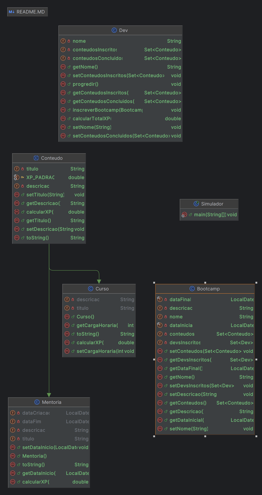

<h1> Desafio: Aprenda na Prática Programação Orientada a Objetos</h1>

 📜 <a href="https://academiapme-my.sharepoint.com/:p:/g/personal/camila_cavalcante_dio_me/EaXyYOjBaFpZjkxhexMo5EcBKMEEAI5t5aHlsTjnBQJlUw?e=nxdB6C"> SLIDES APRESENTADO NO PROJETO </a> 📜 

 Sejam bem-vindos ao desafio: <strong>APRENDENDO NA PRÁTICA O PARADIGMA DE ORIENTAÇÃO A OBJETOS.</strong> Desafio este que tive a honra de co-criar com a plataforma de cursos online <strong><a href="https://web.digitalinnovation.one/">DIGITAL INNOVATION ONE</a></strong> 💛🧡 e disponibilizado de forma gratuita para a comunidade dos desenvolvedores Java. 
    💎 O objetivo principal é colocar em prática umas das principais ferramentas da OO: <strong>ABSTRAÇÃO, ENCAPSULAMENTO, HERANÇA E POLIMORFISMO,</strong> através de um projeto Java. 

<h2>🛑 Pré-Requisitos</h2>

✅ Conhecer a sintaxe da Java 
✅ Java JDK 11 
✅ IDE para desenvolvimento Java  
✅ Git 
✅ Conta no GitHub 

<h2> 👣 Passo-a-Passo</h2>

<strong>	1.</strong> Vamos ABSTRAIR o DOMÍNIO Bootcamp e MODELAR seus ATRIBUTOS E MÉTODOS  
<strong>	2.</strong> Criaremos as CLASSES: Bootcamp, Cursos, Mentorias e Devs e vamos relaciona-las  
<strong>	3.</strong> As CLASSES Curso, Mentoria e Devs também serão MODELADOS, ou seja, criaremos seus ATRIBUTOS E MÉTODOS   
<strong>	4.</strong> Para que o código fique mais legível e de fácil manutenção, iremos utilizar de algumas das ferramentas que o PARADIGMA DE ORIENTAÇÃO A OBJETOS (POO) nos oferece: ABSTRAÇÃO, ENCAPSULAMENTO, HERANÇA E POLIMORFISMO  
<strong>	5.</strong> E para representar CLASSES que foram criadas e relacionadas, iremos transforma-las em OBJETOS 

<h2> Aprendendo na Prática o Paradigma de Orientação a Objetos: Desafio de Criação de uma Plataforma de Bootcamp </h2>

Neste desafio, você terá a oportunidade de aplicar o paradigma de orientação a objetos na prática ao criar uma plataforma de bootcamp. Você desenvolverá uma aplicação que gerencia diferentes aspectos do bootcamp, incluindo:

- **Objetos de Domínio**: Definição dos principais objetos que representam os conceitos centrais da plataforma.
- **Conteúdo**: Gestão e organização dos materiais de aprendizado, como textos, vídeos e quizzes.
- **Curso**: Estruturação dos cursos oferecidos, com tópicos, módulos e avaliações.
- **Bootcamp**: Organização e execução dos programas de treinamento intensivo, incluindo cronogramas e inscrições.
- **Desenvolvedores (Dev)**: Gerenciamento dos perfis dos desenvolvedores, suas inscrições e progresso nos cursos.

