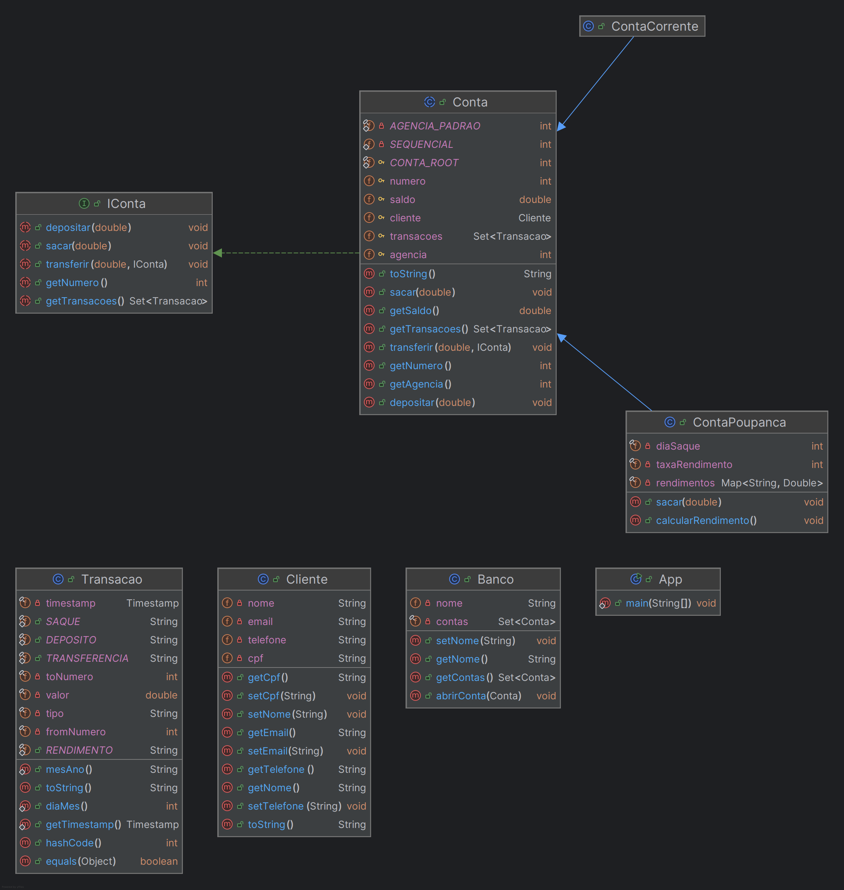

# Criando um Banco Digital com Java e Orientação a Objetos 


## Análise do Problema e Modelagem Orientada a Objetos

**Identificação das Classes:**

* **Conta:** Classe base para todos os tipos de contas, com atributos comuns como número da conta, saldo e cliente.
* **ContaCorrente:** Subclasse de Conta, com funcionalidades específicas como cheque especial.
* **ContaPoupança:** Subclasse de Conta, com funcionalidades específicas como rendimento mensal.
* **Cliente:** Classe para representar os clientes do banco, com atributos como nome, CPF e endereço.
* **Banco:** Classe para representar o banco, com funcionalidades como criar contas, realizar transferências e consultar saldos.

**Diagramas de Classes (UML):**



**Atributos e Métodos:**


* **Conta:**
    * Número da conta (int)
    * Agencia (int)
    * Saldo (double)
    * Cliente (objeto da classe Cliente)
    * Métodos: depositar(), sacar(), transferir()
* **ContaCorrente:**
    * -> Conta
* **ContaPoupança:**
    * ->   
    * Dia de aniversário (Date)
    * Taxa de rendimento (double)
    * Métodos: calcularRendimento()
* **Cliente:**
    * Nome (String)
    * CPF (String)
    * Telefone(String)
    * Email(String)
* **Banco:**
    * Lista de contas (Set<Conta>)
    * Métodos: abrirConta(), buscarConta() 


### Exemplo de Uso

```java

```

### Considerações Adicionais

* **Encapsulamento:** Utilizar modificadores de acesso (public, private, protected) para controlar a visibilidade dos atributos e métodos.
* **Herança:** A hierarquia de classes permite a reutilização de código e a criação de classes mais específicas.
* **Polimorfismo:** Permite tratar objetos de diferentes classes como se fossem de uma classe pai comum.
* **Exceções:** Utilizar try-catch para tratar erros, como saldo insuficiente ou conta não encontrada.
* **Interfaces:** Definir contratos que as classes devem implementar, como a interface `Transferivel` para permitir transferências entre diferentes tipos de contas.


